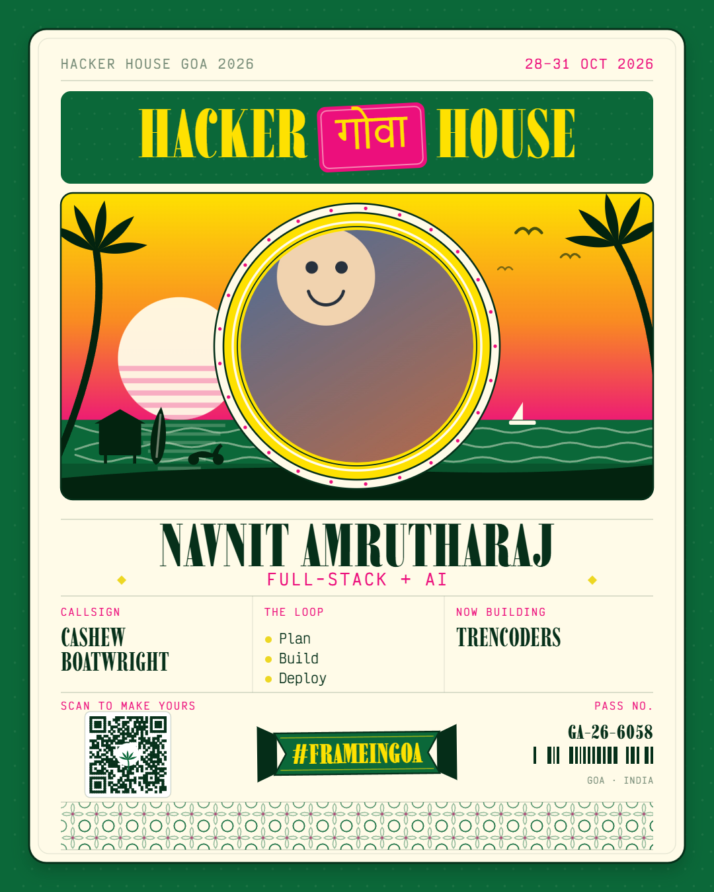
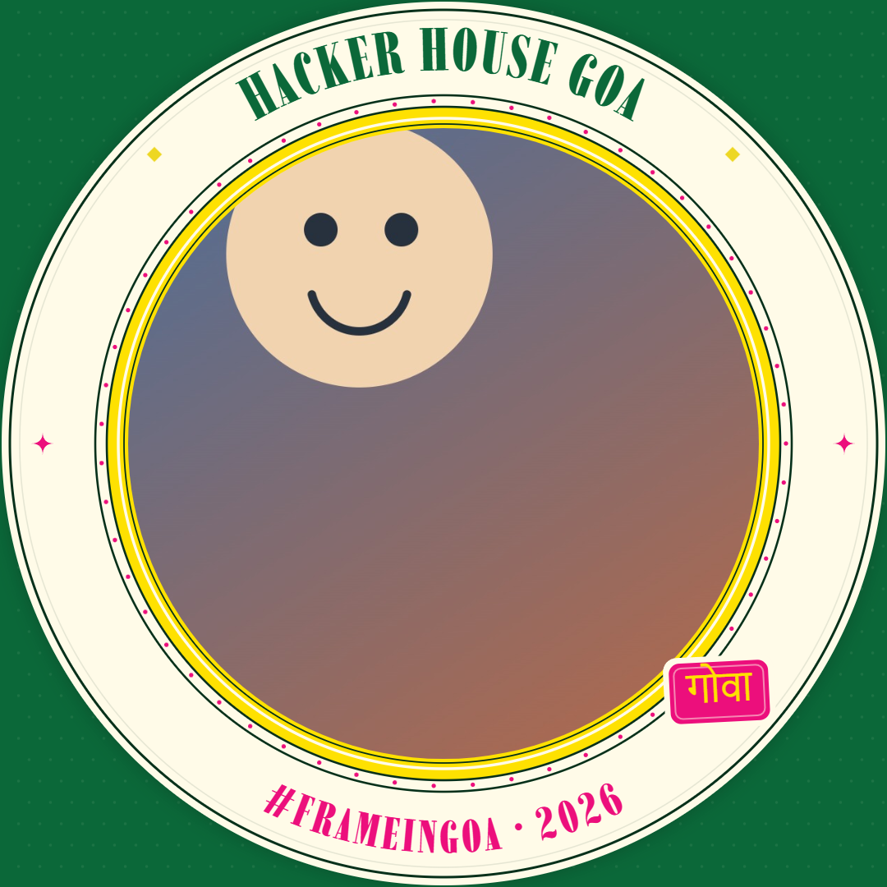
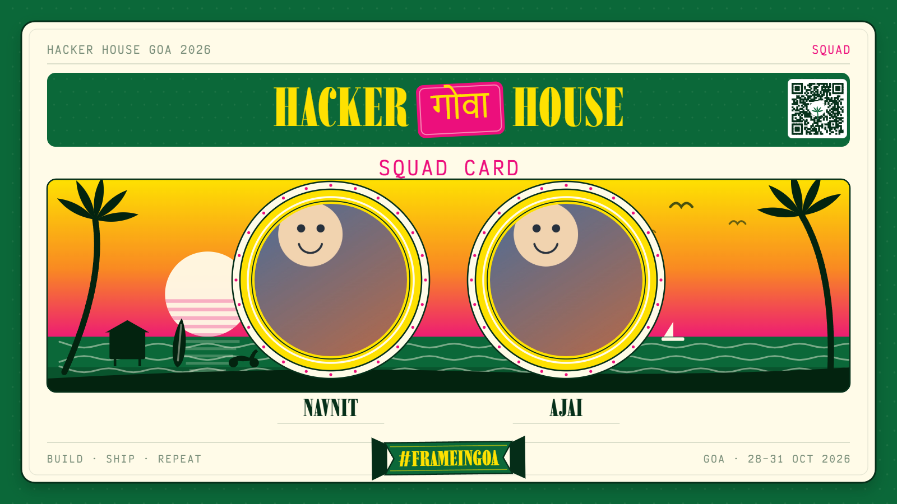
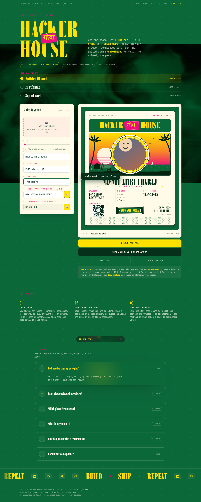
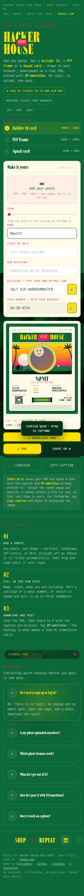

<div align="center">

# HHGoa Frame Generator

**Upload One Photo — Get an On-Brand Hacker House Goa 2026 Graphic**

*A zero-backend browser tool that draws Builder ID cards, PFP frames and Squad cards entirely in code.*

[](assets/app.js)
[](assets/app.js)
[](index.html)
[](DEPLOY.md)
[](LICENSE)

[**Live Demo →**](https://hhgoa.trencoders.com)&nbsp;&nbsp;|&nbsp;&nbsp;[**Deploy Guide →**](DEPLOY.md)&nbsp;&nbsp;|&nbsp;&nbsp;[**Screenshots →**](screenshots/)

</div>

---

## Overview

Built for **Hacker House Goa 2026 · Open Trials · Task 01**. Drop in a photo and the
tool hands back a finished, branded PNG in about ten seconds — no account, no upload,
no loading screen. Three formats are available: a **Builder ID card** (Format B), a
**PFP frame** (Format A) and a bonus **Squad card** that pulls one to three teammates
into a single graphic.

Every pixel is drawn at runtime on an HTML5 canvas. There are no image assets in the
repository — the sunset, palms, beach hut, scooter, surfboard, sailboat, surf, azulejo
tilework, barcode and QR code are all generated in code. There is also no backend, which means there is no
API key, no database and nothing for a photo to be uploaded to.

**What makes this different from typical frame-generator submissions:**

- **The real brand, not an approximation** — the palette (`#0B6839`, `#FEE101`, `#FFFBE8`) and the typefaces (**Imbue** for display, **Victor Mono** for data) were taken from the live `hhgoa.com`, so the cards carry the event's actual identity rather than a green-and-yellow lookalike.
- **The link preview shows a real card** — `og.png` is generated from an actual rendered Builder ID, which is exactly what the brief asks for instead of a blank thumbnail.
- **No secret can leak, because none exists** — the tool is entirely client-side, so there is no provider key in any bundle. A build guard is unnecessary when there is nothing to guard.
- **Its own vocabulary** — the card is framed as a Goan port landing card (callsign, the loop, now building, pass no.) with an Arabian Sea sunset and Portuguese azulejo tilework, instead of the badge-with-a-beach-bag layout every other entry converged on.
- **Verified, not assumed** — layout, mobile rendering and console cleanliness were checked against a headless Chromium run, and the vendored QR encoder was unit-tested for module count and finder patterns before being trusted.

---

## Architecture

```
  User photo (JPG / PNG / WebP / HEIC, any aspect ratio)
        |
        v
  +-------------------------------------+
  |  decode                             |  createImageBitmap with
  |  imageOrientation: 'from-image'     |  EXIF rotation applied
  +------------------+------------------+
                     |
             native decode fails and file is HEIC?
                     |
                     +--> lazy-load heic2any from CDN (SRI-pinned)
                     |    convert to JPEG, decode again
                     v
  +-------------------------------------+
  |  state                              |  name, stack, now building,
  |  photo + pan/zoom + text fields     |  callsign, loop, pass no.
  +------------------+------------------+
                     |
                     v
  +-------------------------------------+
  |  render()  -- Canvas 2D             |  cover-fit into a circle,
  |  drawID / drawPFP / drawTeam        |  clamped pan, brand lockup,
  |  + vendored QR encoder (MIT)        |  sunset scene, azulejo band
  +------------------+------------------+
                     |
        +------------+------------+
        |                         |
        v                         v
  canvas.toBlob()           X / LinkedIn intent
  -> real .png file         -> caption pre-filled
                               with #FrameInGoa
```

---

## Features

| Feature | Detail |
|---------|--------|
| **Builder ID card** | 1080 × 1350 event badge — photo, name, stack, rolled callsign, the plan-build-deploy loop, what you are now building, a pass number, a deterministic barcode and a scannable QR back to the generator. |
| **PFP frame** | 1080 × 1080 overlay sized so the photo fills 71% of the frame and nothing important is lost to X's circular crop. |
| **Squad card** | 1600 × 900 landscape card combining one to three builders, for the "bring your teammates into one frame" brief. |
| **Any photo, no cropping** | Cover-fit plus EXIF orientation handling, then drag to reposition and a zoom slider. Portrait, landscape and off-centre photos all work untouched. |
| **HEIC from iPhone** | Native decode first; `heic2any` is lazy-loaded from a CDN only if a HEIC actually needs converting, so the normal path stays light. |
| **One-click download** | `canvas.toBlob` produces a genuine PNG named after the format and the builder. |
| **One-click share** | Saves the PNG and opens X with the caption and **#FrameInGoa** already written in. LinkedIn and a copy-caption action for Instagram are included too. |
| **Callsign** | Type your own, or roll one from pools built out of Goan geography and harbour trades — "Mandovi Lightkeeper", "Laterite Boatwright". |
| **Animated background** | A WebGL flow field in green-on-black, ported to plain JS from a shader-builder React component. Pauses off-screen, honours `prefers-reduced-motion`, and falls back to flat brand green with no WebGL. |
| **Deterministic barcode** | Bars come from a PRNG seeded by the pass number, so `GA-26-5460` always draws the same barcode and two passes never collide. |
| **Live countdown** | Ticks down to the Task 01 deadline, 11:59 pm IST on 13 August 2026. |
| **Mobile-first** | Built for phones per the brief: touch drag, sticky download and share bar, single-column layout. |
| **Zero data collection** | No accounts, no analytics, no tracking, no network request carrying your photo. |

---

## Tech Stack

| Layer | Technology | Purpose |
|-------|-----------|---------|
| **Markup** | Static HTML5 | One page, server-rendered by virtue of being static — view-source shows real content. |
| **Styling** | Hand-written CSS with custom properties | Brand tokens, mobile-first layout, `prefers-reduced-motion` support. |
| **Rendering** | Canvas 2D API, vanilla JavaScript (ES2020) | All three card designs drawn procedurally; no framework, no build step. |
| **Typography** | Imbue, Victor Mono, Shrikhand (Google Fonts) | The event's own display serif and mono, plus Devanagari for the गोवा badge. |
| **QR encoding** | qrcode-generator 1.4.4 (MIT, vendored) | Level-H QR drawn as our own modules so it matches the card palette. |
| **HEIC decoding** | heic2any (lazy, CDN, SRI-pinned) | Desktop fallback for iPhone HEIC files; unused on iOS, which decodes natively. |
| **Hosting** | nginx on Linode, static files only | Served from an isolated `hhgoa` system user — no runtime, no port, no service. |

---

## Project Structure

```
HH-GOA26/
├── index.html              # the app: markup, meta, OG tags, JSON-LD, FAQ
├── 404.html                # branded not-found page
├── assets/
│   ├── styles.css          # design system + responsive layout
│   ├── shader-bg.js        # WebGL flow-field background, vanilla port
│   ├── app.js              # state, decoding, the three card renderers, share
│   └── vendor/
│       └── qrcode.min.js   # MIT QR encoder, vendored with its licence header
├── screenshots/            # card and app captures used in this README
├── og.png                  # 1200x630 link preview, built from a real card
├── favicon.svg             # palm mark
├── apple-touch-icon.png    # 180x180 iOS icon
├── robots.txt              # crawl policy, AI crawlers allowed deliberately
├── sitemap.xml             # single-URL sitemap
├── llms.txt                # plain-language description for AI crawlers
├── DEPLOY.md               # Linode + nginx deployment, isolated user
├── LICENSE                 # Source Available, plus third-party notices
└── README.md
```

---

## Quick Start

### Prerequisites

- Any modern browser. That is the whole list — there is no Node, no package install and no build step.
- Optionally Python or Node, if you would rather serve over HTTP than open the file directly.

### 1. Clone

```bash
git clone https://github.com/ninjacode911/HH-GOA26.git
cd HH-GOA26
```

### 2. Serve it

The page uses root-absolute asset paths (`/assets/...`), so serve it over HTTP
rather than opening `index.html` from the filesystem:

```bash
python -m http.server 8000
# or
npx serve .
```

### 3. Open it

```
http://localhost:8000
```

### 4. Use it

1. Pick a format — Builder ID card, PFP frame or Squad card.
2. Add a photo, then drag it in the preview and use the zoom slider to frame it.
3. Fill in name and stack, and roll a callsign or pass number if you like.
4. Press **Download PNG**, then **Share on 𝕏** — attach the saved image and publish with **#FrameInGoa**.

---

## Security

| Control | Implementation |
|---------|----------------|
| **No secrets to leak** | The tool is fully client-side and reads no API key. `.env` is gitignored and `.env.example` carries names only. |
| **No photo leaves the device** | Decoding and rendering happen in the browser; there is no upload endpoint and no backend to receive one. |
| **No third-party script at runtime** | The QR encoder is vendored locally. The only remote script is `heic2any`, lazy-loaded and pinned with a verified SHA-512 SRI hash. |
| **No `innerHTML` on user input** | Squad member rows are built with DOM APIs, so a name can never be parsed as markup. |
| **Upload validation** | MIME and extension checked, and a 25 MB size ceiling is enforced before decoding. |
| **External links** | Every `target="_blank"` carries `rel="noopener noreferrer"`. |
| **Security headers** | CSP, HSTS, `X-Content-Type-Options`, `Referrer-Policy` and `Permissions-Policy` are set in the nginx server block — see [DEPLOY.md](DEPLOY.md). |
| **Deployment isolation** | Runs as static files under a dedicated unprivileged `hhgoa` user with no shell login; nginx only gains read traversal. |

---

## Screenshots

<div align="center">

**Builder ID card · PFP frame · Squad card**





**The app, desktop and mobile**




</div>

---

## License

**Source Available — All Rights Reserved.** See [LICENSE](LICENSE) for full terms.

The source code is publicly visible for viewing and educational purposes. Any
use in personal, commercial, or academic projects requires explicit written
permission from the author.

To request permission: navnitamrutharaj1234@gmail.com

**Author:** Navnit Amrutharaj
